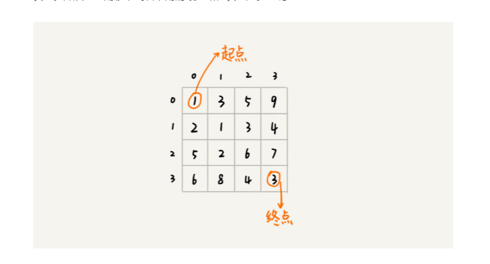
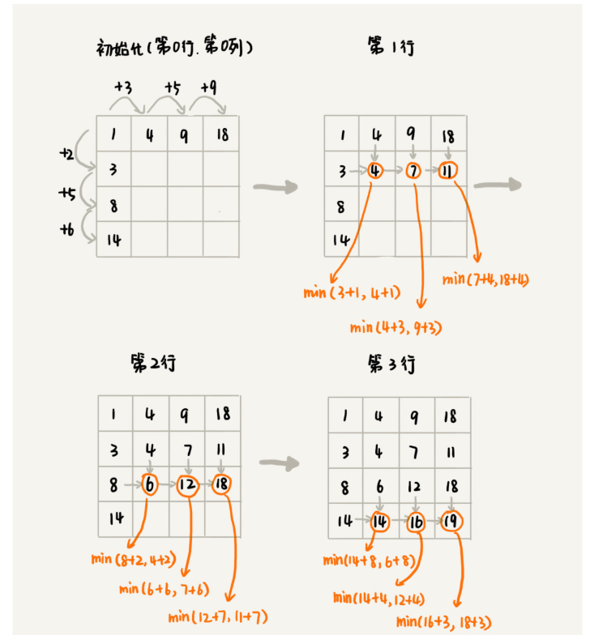

动态规划总结

1. 最优子结构：每一步优都是由上一步的最优组成的
2. 重复子问题：不同的决策序列，到达某个相同的阶段时，可能会产生重复的状态，比如下面这个问题，p[2,3]这个点，可以有不同的路线过来，而实际上，我们只需要递归最短那一条即可
3. 无后效性：后面的决策不会影响前面的决策，比如，不允许后退

#### 最短路线问题

问题：求起点到终点的最短路线



##### 动态规划方程求解

方程：min_dist[r, c] = p[r][c] + min(min_dist[r - 1, c], min_dist[r, c - 1])

```js
/**
* 如果不加memory的话，时间复杂度其实还是指数型的
* 因此动态规划本身的思想，不知道能不能替身效率，待思考
*/
// 路线表
const p = [
  [1, 3, 5, 9],
  [2, 1, 3, 4],
  [5, 2, 6, 7],
  [6, 8, 4, 3]
]

function calMinDist (p, i, j) {
  const memory = (new Array(i + 1)).fill(null).map(() => (new Array(i + 1)).fill(null))
  function calMinPath (r, c) {
    if (memory[r][c]) return memory[r][c]

    // 边界条件
    if (r === 0 && c === 0) {
      return p[0][0]
    }

    if (r === 0) {
      return p[r][c] + calMinPath(r, c - 1)
    }

    if (c === 0) {
      return p[r][c] + calMinPath(r - 1, c)
    }

    const result = p[r][c] + Math.min(calMinPath(r - 1, c), calMinPath(r, c - 1))
    memory[r][c] = result
    return result
  }
  return calMinPath(i, j)
}
```

##### 动态规划表求解

每一格的最小值，都是上左两格的最小值之和，因此可以按照下图迭代


