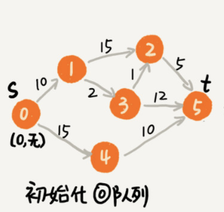

### 最短路径-Dijkstra

最短路径计算一般都是以图模型出现的，图具有很好的表达能力，在下面的图中，边代表着距离，目前该权重项我们只讨论距离一项。

要得到最短了路径，我们首先想到的是遍历。

1. 我们可以利用深度遍历和广度遍历两种遍历模式去计算所有s到t的路径长度，然后选出一个最短的。但是，这种遍历实现在有向无环图中实现寄来非常容易，但是在如果对于无相图，或者有向有环图，就会变得复杂，因为我们在环产生的时候要回溯，因此就多了一步对环的判断，这样让本来就高的时间复杂度更高了，所以这不是最优算法，最差的复杂度是指数级的。

2. 可以看出这是一个多决策最优问题，每个决策其实都代表了一个状态，因此利用动态规划是解决这类题目的很好方案，我们每步决策都用`state(v, dist)`来表示，其中`v`代表某一个点的编号,`dist`代表该步决策的距离，可以看到2号点有两种可能产生的状态：`state(2, 25)`表示`0 -> 1 -> 2`路线， `state(2, 13)`表示`0 -> 1 -> 3 -> 2`路线，这样遍历到点2的时候，如果产生过`state(2, 13)`的状态，则在`state(2, 25)`是产生回溯。这个增强版算法很好的提高了效率，也不用特意去在意环的问题，但是遍历过程中得最差时间复杂度还是指数级别的。

3. 第二个解决方案不够完美的原因是，我们无法保证`state(2, 13)`先于`state(2, 25)`执行，如果某种机制能保证我们每次选择都是最短的dist，则可以保证每一个点都不会不出现这种情况`先出现距离长的，再出现距离短，这样就能保证每一点都只有一条路线经过`，Dijkstra算法使用的就是`广度遍历机制 + 小顶堆`来做这么一件事情（堆保证了每次取得都是最小的dist），从起始点遍历的点`state(v, dist)`，会根据`dist`被堆化加入小顶堆，再取出堆顶的点（被去顶的堆要再堆化），遍历该点的相邻点并计算相应的`state(v, dist)`，如果堆中不存在该`v`，将其推入堆中，如果存在则更新该`v`的`dist`（两者取小），直到去顶取到`state(t, last_dist)`，该`last_dist`就是我们需要的最短路线

4. 这边为什么使用堆来做排序？因为在寻找最短路径的过程中会有多次排序，而堆在第一次堆化排序的时间复杂度为O(nlogn)，但是后续的排序只有O(logn)，也就是一次堆化会让后续的多次排序及其高效，因此这边作者会采用堆。

这边是我对该算法的个人理解，不一定对，详细代码还是看极客时间的最短路径算法这个篇章。