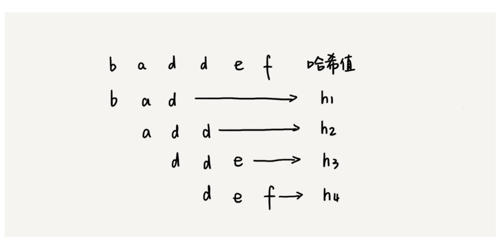

### BF

暴力比较字符串，如果主串m，子串n，时间复杂度为O(m * n)

```javascript
function bfCompare (mainStr, subStr) {
  const mainLength = mainStr.length
  const subLength = subStr.length

  if (mainLength < subLength) return false

  const compareTimes = mainStr.length - subStr.length

  for (let i = 0; i <= compareTimes; i++) {
    let isAllRight = true
    for (let k = 0; k < subLength; k++) {
      if (mainStr[k + i] !== subStr[k]) {
        isAllRight = false
        break
      }
    }
    if (isAllRight) return true
  }

  return false
}
```

### RK

RK算法就是计算子串的hash值，并和主串截取子串长度的hash一步步比较得出结果

计算每个子串的hash只需要遍历一次主串就可（套公式），



```javascript
/* 这道题是用模拟26进制类代替hash */
/* abc => a * 26 * 26 + b * 26 + c * 26 */
/* 如果26进制造成位数太大，可以降低，造成的hash冲突可以bf的匹配方式 */
const alphabet = ['a', 'b', 'c', 'd', 'e', 'f', 'g', 'h', 'i', 'j', 'k', 'l', 'm', 'n', 'o', 'p', 'q', 'r', 's', 't', 'u', 'v', 'w', 'x', 'y', 'z']

const map = alphabet.reduce((acc, item, index) => {
  acc[item] = index + 1
  return acc
}, {})

/* 计算公式，具体看课件 */
const calculate = (preSum, p1, p2) => {
  return (preSum - p1) * 27 - p2
}

const rkCompare = (mainStr, subStr) => {
  const mainLength = mainStr.length
  const subLength = subStr.length
  let preMainHash = null

  if (mainLength < subLength) return false

  const subHash = subStr.split('').reduce((sum, c, i) => {
    sum += map[c] * Math.pow(27, subLength - i - 1)
    return sum
  }, 0)

  const compareTimes = mainStr.length - subStr.length

  for (let i = 0; i <= compareTimes; i++) {
    let mainHash = null
    if (preMainHash === null) {
      mainHash = mainStr.slice(i, subLength).split('').reduce((sum, c, i) => {
        sum += map[c] * Math.pow(27, subLength - i - 1)
        return sum
      }, 0)
    } else {
      mainHash = calculate(preMainHash, mainStr[i - 1], mainStr[subLength + i])
    }
    preMainHash = mainHash

    if (mainHash === subHash) return true
  }

  return false
}
```