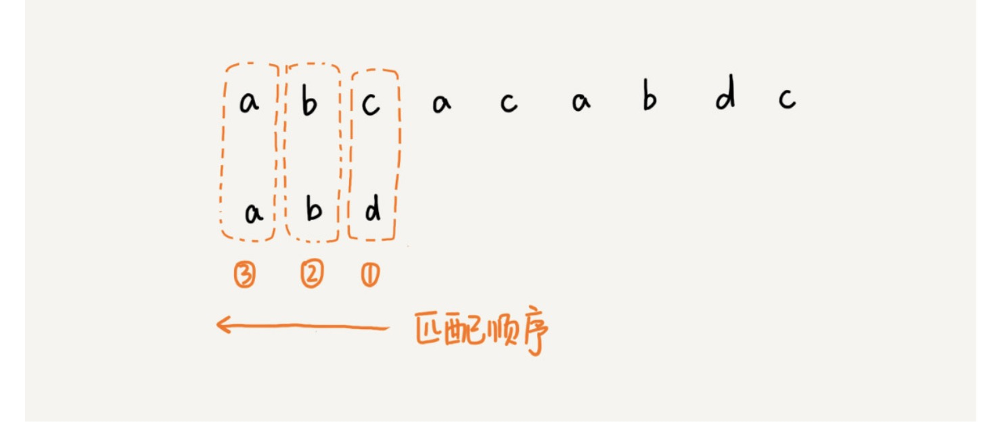
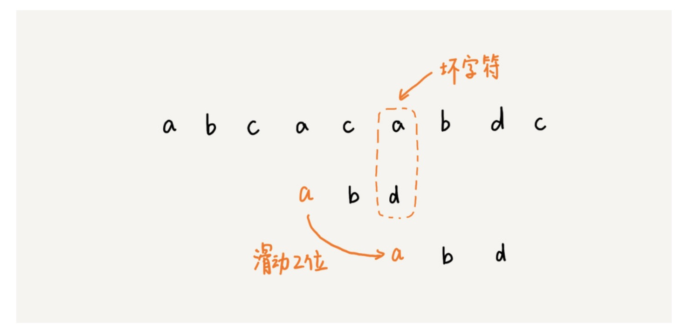
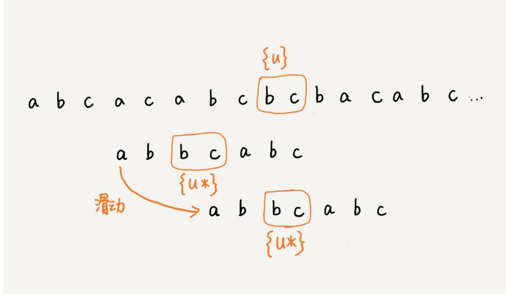
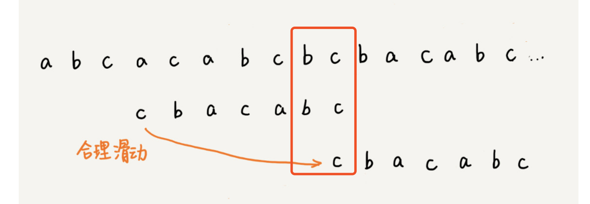

看的脱发

> 极客时间-数据接口与算法-BM算法

参考链接：http://www.cs.jhu.edu/~langmea/resources/lecture_notes/boyer_moore.pdf

#### 名词

1. 主串：被匹配字符串

2. 模式串：拿去匹配的字符串

#### 匹配顺序

BM算法的匹配是从模式串的尾部匹配的模式串的头部的

#### 坏字符规则

坏字符规则很简单，就是不匹配的第一个字符为坏字符，然后找最靠后的第一个匹配字符并移动

#### 好后缀规则

比较不好理解，匹配成功的字符串被称之为好后缀，如果发生不匹配，先去模式串中找是否存在其他的好后缀，如果有就移动到该位置

如果没有就找模式串的前缀有没有匹配好后缀的后缀子串的

以上就是BM算法的匹配规则，实现的话重点在于好后缀的模式串预处理，要对模式串的每个后缀子串做是否存在其他位置的相同子串----suffix，该相同的子串是否是在头部----prefix，这样就基本完成了预处理

通篇的代码不做实现可以参考极客时间

#### 总结

无论BM还是KMP算法都是对模式串进行预处理，以便快速的找到快进的步数。

可以理解这种好后缀的算法原理是利用未匹配的模式串子串，是否存在匹配改好后缀，来决定是否可以快进或者略过好后缀

BM算法咋主串上的匹配是跳跃式的，而KMP算法在主串上是一步一步的，这个能就是KMP算法慢于BM算法原因、
