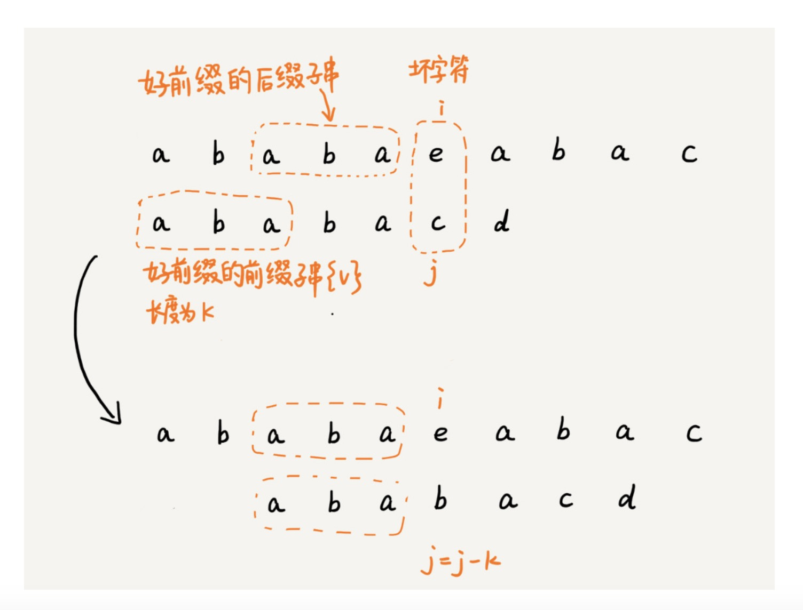
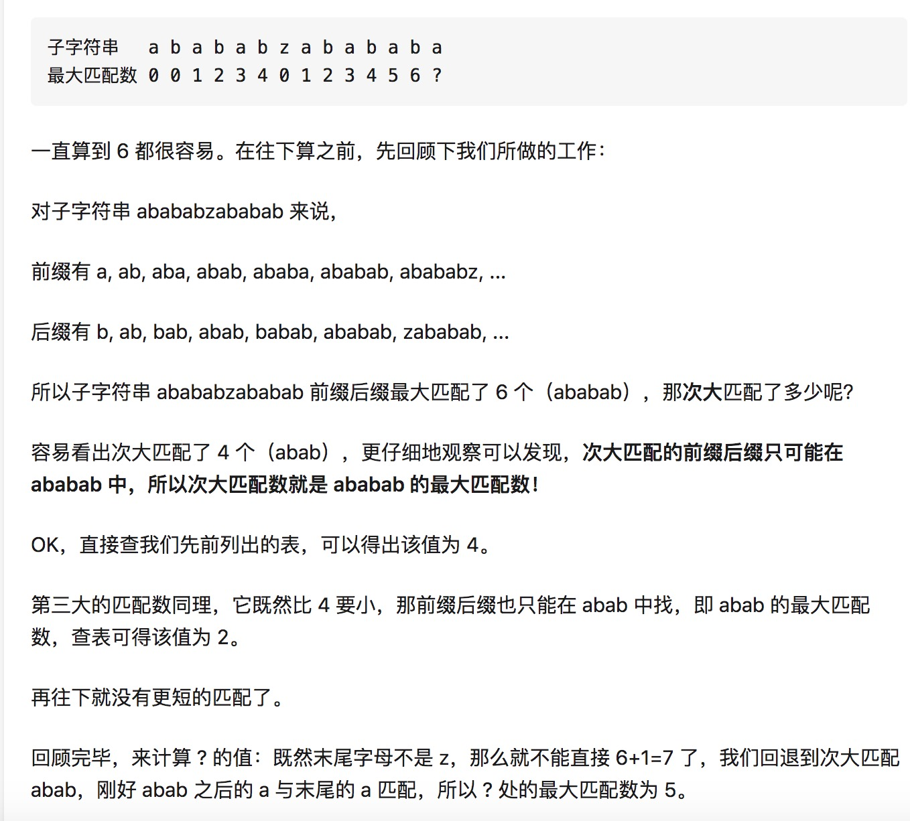

KMP算法和BM算法是类似的，都是跳过尽可能多的匹配
 
KMP原则：

#### 好前缀



如上图，子串`ababa`是匹配的成功的子串，这是kmp算法的做法不是移到下一位重新匹配，而是找到成功匹配子串的最大匹配的后缀子串和前缀子串，然后移动至他们重合，这时主串的匹配位置是i，模式串的匹配位置是j-k。

#### 预处理模式串

如何快速的找到模式串每个位置的的前后缀最大匹配串？



这个段落其实写的比较详细了，这边用了一个动态规划的想法，求arr[7]的最大匹配数next[7]，我们只需要知道arr[6]的next[6]，如果next[6]的下一位和arr[7]相等，则next[7] = next[6] + 1，否则就看arr[6]的次长匹配数，在进行+1判断，这样变成了寻找次长匹配数问题，二次长匹配数其实就只最长匹配串中的最大匹配数，这样层层递进，其实这么说不好理解，以后忘就去再看教程。

其实分解了过程就是

要查找arr[i]的next[i]

```javascript
next[i] 
if arr[next[i - 1] + 1] === arr[i]
= next[i - 1] + 1

// 去寻找arr[i - 1]的次长匹配前缀，即其最长匹配前缀的最长匹配前缀
else if arr[next[next[i - 1]] + 1] === arr[i]
= next[next[i - 1]] + 1

// 层层递进
else if
....

else if next[0] occurs and compare arr[0] with arr[i]

then move
```

这边摘取最复杂的预处理模式串进行实现，本质上是一个动态规划的过程

```js
function preProcess (str) {
  // 对应下标的最大匹配前缀所在位置，默认不能匹配都对应-1
  const next = new Array(str.length).fill(-1)

  for (let i = 0; i < str.length; i++) {
    // 第一位无法匹配
    if (i === 0) continue

    let j = i
    while (true) {
      if (j - 1 < 0) break

      /**
       * 如果匹配成功直接 + 1返回 
       */
      if (str[next[j - 1] + 1] === str[i]) {
        next[i] = next[j - 1] + 1
        break
      }

      /**
       * 如果上一级匹配串不成立，则进入下一级匹配串
       * 而下一级匹配串就是上一级匹配串的最大匹配后缀
       */
      j = next[j - 1]
    }
  }

  return next
} 
```