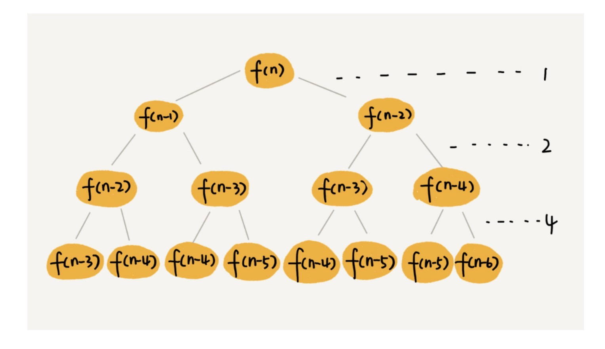

1. 递推公式，其实就是想好这个方法是用来做什么的，如何拆解
2. 边界
3. 返回值

### 递归的复杂度分析

> 套用递推公式

```javascript
function getSum (num) {
  if (num === 0) return 0

  return num + getSum(num - 1)
}

/**
 * K为getSum中的除了递归调用的其他程序，其为常量
 * T(n) = T(n-1) + K ==> T(n) = Kn ===> 复杂度为O(n)
 */
```

### 调用递归前和调用递归后

```javascript
function a () {
  // 这个TODO是自上而下的，如快速排序一样的，先执行后递归
  TODO...

  // 递归
  a()

  // 这个TODO是自下而上的，如归并排序，先做递归，再从底部向上执行
}
```

---

### 利用递归树来分析递归的复杂度分析

#### 归并的复杂度分析


首先，我们算出每个递归所做操作的复杂度，归并的操作主要是将两个数组合并，所以复杂度为O(n)，所以如上图，总复杂度为O(n * h)，而归并为非严格意义上的满二叉树，总高度为log2n，所以总复杂度为O(nlogn)

#### 斐波那契数列的时间复杂度



同上，每层每个递归复杂度为1，最大层数为n，最小层数n / 2，最大为 1 + 2 + 4 + 8 + 2^(n - 1) = 2^n - 1, 所以最大为O(2^n), 最小通过计算也是O(2^n)级别的，所以其平均复杂度为O(2^n)

#### 实现数列的全排列输出

> 1 2 3 => 123 132 213 231 312 321

```javascript
function printPermutations (arr, data) {
  const length = arr.length

  if (length <= 1) {
    return console.log(...data, ...arr)
  }

  for (let i = 0; i < length; i++) {
    const newArr = arr.slice(0, i).concat(arr.slice(i + 1, length))
    const newData = data.concat(arr.slice(i, i + 1))
    printPermutations(newArr, newData)
  }
}
```


通过计算这个复杂度在O(n!) 到 O(n * n!)之间

#### 函数柯里话

```js
const curryFn = curry(fn, 3)
curryFn(1)(2)(3) 
```

```js
// curry(fn, n) = (arg) => { curry(fn, n-1) }
function curry (fn, times) {
  const args = []
  const innerCurry = (fn, times) => {
    if (times === 1) return (arg) => {
      return fn(...args, arg)
    }

    return (arg) => {
      args.push(arg)
      return innerCurry(fn, times - 1)
    }
  }
  return innerCurry(fn, times)
}

// 迭代法实现
function curry (fn, times) {
  const args = []

  let newFn = (arg) => {
    return fn(...args, arg)
  }

  while (times - 1 > 0) {
    const oldFn = newFn
    newFn = (arg) => {
      args.push(arg)
      return oldFn
    }
    times--
  }

  return newFn
}
```